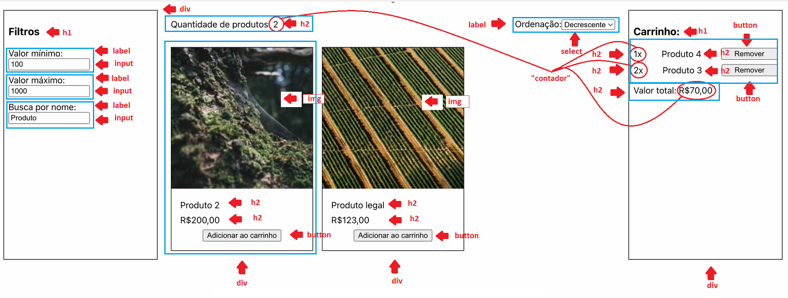
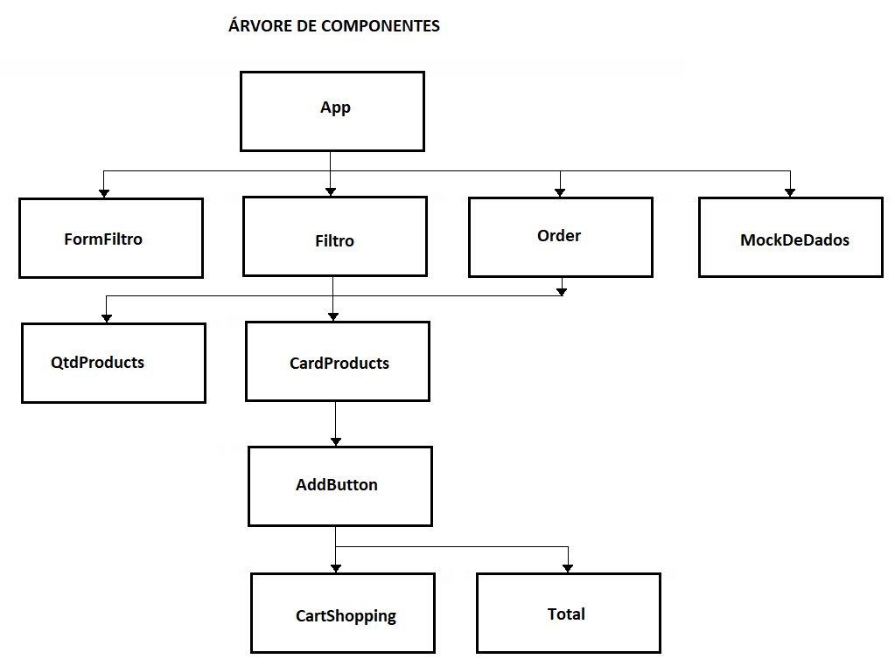

# THINKING REACT

## Índice

* [Título e Imagem de capa](#4cars)
* [Índice](#índice)
* [Descrição do Projeto](#descrição-do-projeto)
* [Árvore de componentes](#árvore-de-componentes)
* [Mock de Dados](#mock-de-dados)
* [Status do Projeto](#status-do-projeto)
* [Funcionalidades e Demonstração da Aplicação](#funcionalidades-do-projeto)
* [Acesso ao Projeto](#acesso-ao-projeto)
* [Tecnologias utilizadas](#tecnologias-utilizadas)
* [Pessoas Desenvolvedoras do Projeto](#pessoas-desenvolvedoras-do-projeto)
* [Conclusão](#conclusão)

📝
## Descrição do Projeto

- Criação de e-commerce com filtros para pesquisa de produtos

## Mock

## Árvore de componentes

ℹ️
## Status do Projeto

🚧 Projeto em construção 🚧 

🛠️ 
## Funcionalidades do projeto

- `APP`: Apresentação dos produtos com suas informações, filtros para pesquisa e ordenação e totalizador dos itens selecionados.
- `Filtro de preços`: Permite ao usuário pesquisar o preço mínimo e máximo do pruduto procurado.
- `Filtro de nome`: Permite ao usuário pesquisar por parte do nome do pruduto procurado.
- `Ordenação`: Permite ao usuário ordenar o resulta da pesquisa por ordem alfabética, crescente ou decrescente.
- `Carrinho`: Mostra ao usuário os produtos selecionados, com seus respectivos preços e quantidade, e ainda dá a possibilidade de adicionar ou remover algum produto.

📁
## Acesso ao projeto

**Link do surge**

🛠️
## Tecnologias utilizadas

- **JAVASCRIPT**
- **REACT**

🤓
## Pessoas Desenvolvedoras do Projeto

| [ Giovana Vieira](https://github.com/gioivieira) |  [ Byron Smith](https://github.com/byron-smith-nobrega) |  [ Samuel Garcia](https://github.com/Samuca010) |
| :---: | :---: | :---: |

✔️
## Conclusão

Projeto desenvolvido em grupo, com grande cooperação de todos e alcançando resultado acima do exigido, e superando nossas próprias expectativas.